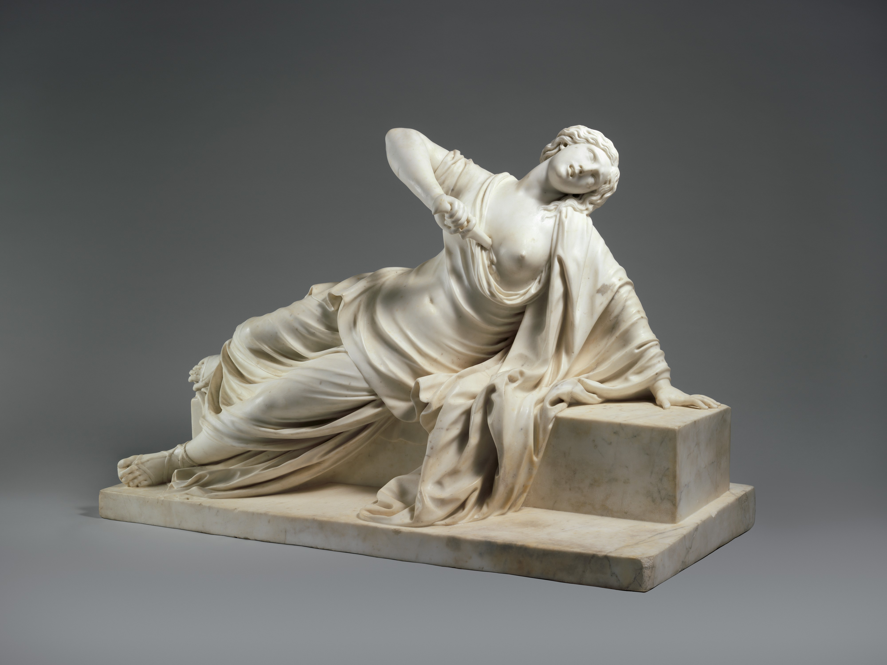
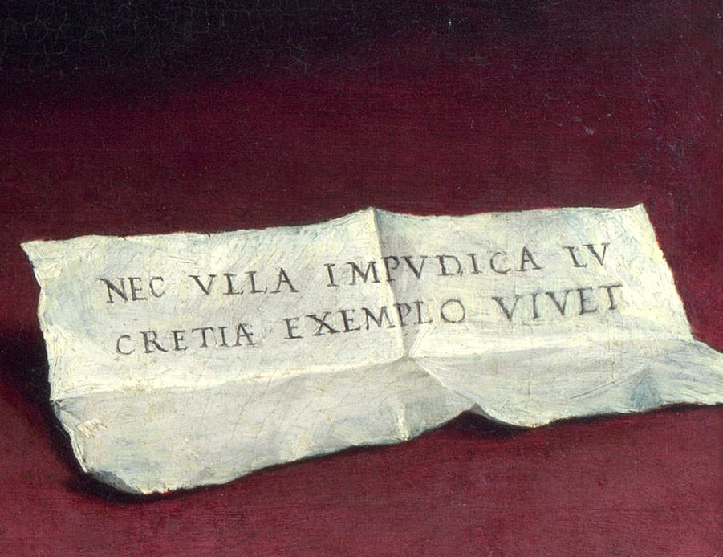

# Challenging Conventions: Lotto's Lucretia

A visual exploration of Lorenzo Lotto's enigmatic depiction of Lucretia: In this captivating painting, Lotto challenges the norms of his time by portraying a woman in a manner deemed unconventional for a Renaissance lady. 

img src='img/Lucretia_Bild.jpg' class='noresize'>

[Portrait of a Woman Inspired by Lucretia, Lorenzo Lotto, c. 1533, oil-on-canvas, 96 cm × 110 cm,  National Gallery London](https://www.nationalgallery.org.uk/paintings/lorenzo-lotto-portrait-of-a-woman-inspired-by-lucretia)

*This visualization is based on the article “Lotto’s Lucretia” by Rona Goffen from the Renaissance Quarterly journal vol. 52, no. 3, 1999.*

Scroll along to find out who was Lucretia, what are the key elements of the painting and why is it deemed unconventional.

---

## But first … Who was the Roman heroine Lucretia? 

To understand Lotto’s painting, we must first know the story of the **Roman heroine Lucretia**. The legend of Lucretia, the wife of Collatinus,  was used in the Roman Republic to symbolize proper womanly virtues such as beauty and chastity and her story was an inspiration for many writers and artists in later times.

The story begins with a drinking bet between young men at Sextus Tarquinius' home, the son of the king of Rome. They decide to surprise their wives to see how they behave in their absence. Lucretia, the wife of Collatinus, behaves virtuously, unlike the other wives of the king's sons. Several days later, Sextus Tarquinius goes to Collatinus' home and is given hospitality. When everyone else is asleep in the house, he goes to Lucretia's bedroom and threatens her with a sword, demanding that she submit to his advances. When she shows no fear of death, he threatens to kill her and stage her body with a servant's to imply adultery. rewrite: She submits, but in the morning calls her father, husband, and uncle and she tells them how she has "lost her honor" and demands that they avenge her rape. Though the men try to convince her that she bears no dishonor, she disagrees and kills herself, her "punishment" for losing her honor.

_Lewis, Jone Johnson. (2023, April 5). The Legend of Lucretia in Roman History. Retrieved from https://www.thoughtco.com/lucretia-roman-noble-biography-3528396_

_Tarquin and Lucretia, Titian, 1571, oil-on-canvas, 188.9 cm × 145.1 cm,  Fitzwilliam Museum, Cambridge_

_Lucretia, Philippe Bertrand, 1704 or earlier, marble, 69.9 × 109.9 × 52.7 cm,  The Metropolitan Museum of Art, New York City_

**“nor in time to come shall any unchaste woman live if she follows Lucretia's example”** - her last words
---

## What

A *Syllabus Site* is a one-page website arranging its elements along sections that can be scrolled vertically.

### Design

The webpage is designed with the aim to open an evocative information space, where the sources that foster creativity, dialogue, and learning can be gathered, recapitulated, and appreciated. The monolithic structure of conventional documents is broken up, by introducing a relational quality to the connections between sections and items.

### Structure

There are two main types of elements:

- **Sections** – Larger blocks gather the material for weekly course sessions.
- **Items** – Smaller elements feature images, text, and other content.

Each item is connected with its section by a thin line. The navigation (≡) gives access to all sections.

The last section acts as the footer, where the typical array of logos and links belongs.

### Examples

The template is in use to document the following [Interface Design](https://interface.fh-potsdam.de) courses offered at [FH Potsdam](https://www.fh-potsdam.de/):

- **[Decolonizing Data Visualization – Visualizing Postcolonies](https://infovis.fh-potsdam.de/decolonizing/)** (Summer 2022)
- **[Organigrams for/from the future](https://infovis.fh-potsdam.de/organigrams/)** (Summer 2023)

[Decolonizing Data Visualization – Visualizing Postcolonies](https://infovis.fh-potsdam.de/decolonizing/)

[Organigrams for/from the future](https://infovis.fh-potsdam.de/organigrams/)

---

## How

The *Syllabus Site* template can be easily used with minimal technical requirements.

  
Page content and source side by side

### Get started

1. Download or clone the [GitHub repository](https://github.com/uclab-potsdam/syllabus-site/)
2. Give your page a title, fill out open graph fields, and adjust theme color in `index.html`
3. Add your content into `README.md` and `img/`

### Files

The template has the following file structure:

      img/
      index.html
      src/
      README.md

The `README.md` file contains all the textual content of your page and references the images that you need to add to the `img/` directory. 

The `index.html` file connects template and your content; here you need to make a few edits to add title, description, and preview of your webpage. 

You do not need to change anything within `src/`, which contains the internal files of the template.

### Syntax

The `README.md` uses the [Markdown](https://en.wikipedia.org/wiki/Markdown) format, a markup language used by many platforms including GitHub.

There are two conventions we introduce to distinguish and connect sections and items:

- **Sections** are delineated by a horizontal rule `---` 
- **Items** are separated by two empty consecutive lines

Each section should contain a heading:
`#` for primary, `##` for secondary, and so on.

To exclude a section from the navigation menu, include `<!--skipnav-->` at the start of the section.

### Things to consider

- Include an expressive preview image `img/cover.png` so that your page can be previewed on social media and messaging apps.
- Given that your webpage might be accessed from a mobile device with a slow connection make sure to optimize image file sizes.

---

## Who

*Syllabus Site* was put together by [Philipp Proff](https://philippproff.eu) and [Marian Dörk](https://mariandoerk.de) with the helping hands from many people.

**Markdown munching**: [Marked](https://marked.js.org) by Christopher Jeffrey

**Terrific typeface**: [HK Grotesk](https://github.com/HankenDesignCo/HK-Grotesk) by Alfredo Marco Pradil

**Friendly feedback**: Myriel Milicevic, Lamin Manneh, Fidel Thomet, Mark-Jan Bludau, Sabine de Günther and Francesca Morini

**Yes, you!**: Syllabus Site is [made available](https://github.com/uclab-potsdam/syllabus-site/) under the liberal MIT license. Feel free to reuse and revise it!

---

 
 

[Contact](mailto:marian.doerk@fh-potsdam.de,philipp.proff@gmx.de?subject=Syllabus%20Site) · [Imprint](https://www.fh-potsdam.de/impressum) · *This is a [Syllabus Site](https://infovis.fh-potsdam.de/syllabus-site/)*
