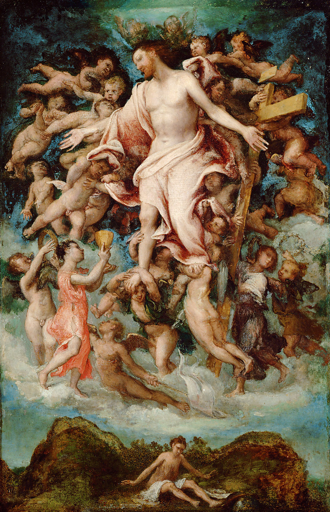
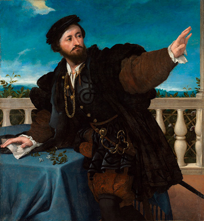
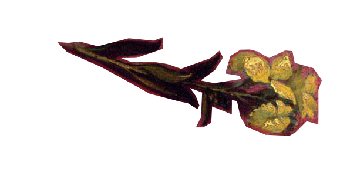

# Challenging Conventions:  
# Lotto's Lucretia

A visual exploration of Lorenzo Lotto's enigmatic depiction of Lucretia: In this captivating painting, Lotto challenges the norms of his time by portraying a woman in a manner deemed unconventional for a Renaissance lady.

[Portrait of a Woman Inspired by Lucretia, Lorenzo Lotto, c. 1533, oil-on-canvas, 96 cm × 110 cm,  National Gallery London](https://www.nationalgallery.org.uk/paintings/lorenzo-lotto-portrait-of-a-woman-inspired-by-lucretia)

_This visualization is based on the article “Lotto’s Lucretia” by Rona Goffen from the Renaissance Quarterly journal vol. 52, no. 3, 1999. All citations from this text will be marked with an asterisk (*)._

Scroll along to find out about [the Roman heroine Lucretia](#but-first-…-who-was-the-roman-heroine-lucretia?), [Lotto´s Lucretia](#her-identity), the [key elements](#veil) of the painting and why is it deemed [unconventional](#a-dual-identity:-masculine-strength,-feminine-honor).

Strong-looking women are not to be found in most Renaissance paintings. Why is she staring at us like that? What is she pointing at? At first glance, it is a portrait of a wealthy woman. However, a closer look reveals an image that challenges the traditional stereotypes of women as objects of the male gaze.

---

## But first … Who was the Roman heroine Lucretia? 

To understand Lotto’s painting, we must first know the story of the **Roman heroine Lucretia**. The legend of Lucretia, the wife of Collatinus,  was used in the Roman Republic to symbolize proper womanly virtues such as beauty and chastity and her story was an inspiration for many writers and artists in later times.

The story begins with a drinking bet between young men at Sextus Tarquinius' home, the son of the king of Rome. They decide to surprise their wives to see how they behave in their absence. Lucretia, the wife of Collatinus, behaves virtuously, unlike the other wives of the king's sons. Several days later, Sextus Tarquinius goes to Collatinus' home and is given hospitality. When everyone else is asleep in the house, he goes to Lucretia's bedroom and threatens her with a sword, demanding that she submit to his advances. When she shows no fear of death, he threatens to kill her and stage her body with a servant's to imply adultery. She submits, but in the morning calls her father, husband, and uncle, and she tells them how she has “lost her honor” and demands that they avenge her rape. Though the men try to convince her that she bears no dishonor, she disagrees and kills herself, her “punishment” for losing her honor.

_Lewis, Jone Johnson. (2023, April 5). The Legend of Lucretia in Roman History. Retrieved from https://www.thoughtco.com/lucretia-roman-noble-biography-3528396_

  
_Tarquin and Lucretia, Titian, 1571,  
oil-on-canvas, 188.9 cm × 145.1 cm,  
Fitzwilliam Museum, Cambridge_

  
_Lucretia, Philippe Bertrand, 1704 or earlier,  
marble, 69.9 × 109.9 × 52.7 cm,  
The Metropolitan Museum of Art, New York City_

 
_Detail from Lucretia, Rembrandt, 1666, oil-on-canvas, 110.2 cm × 92.3 cm, Minneapolis Institute of Arts, Minneapolis_

---

## Lorenzo Lotto

Lorenzo Lotto (about 1480 - 1556) was an important Italian painter of the High Renaissance and early Mannerism. He painted almost exclusively religious subjects, portraits, and a few allegorical pictures. Lotto worked mainly in Northern Italy and is traditionally included in the Venetian School. His art follows the naturalistic ideals of the High Renaissance, but he often disrupts their typical harmony with unusually dynamic poses and distortions.

  
_Lorenzo Lotto: presumed Self-Portrait,  
Lorenzo Lotto, 1540s, oil on panel, 43 × 35 cm,  
Thyssen-Bornemisza Museum, Madrid_

  
_Christ giving his Blood, Lorenzo Lotto,  
1543, oil on poplar wood, 50 × 32 cm,  
Kunsthistorisches Museum, Vienna_

  
_Portrait of a Married Couple, Lorenzo Lotto, c. 1523 - 1524, oil on canvas, 96 × 116 cm, The State Hermitage Museum, Saint Petersburg_

---

## Thesis

The article opens with a thesis from the author:

_“Lottos' Lucretia is posed in a way that Renaissance viewers would have recognized as masculine and therefore inappropriate for a lady. Moreover, Lucretia holds a fictive drawing, representing the suicide other Roman namesake. The depiction of a fictive drawing was quite exceptional in the 1530s. Lotto' reasons for posing his Lucretia in such an unexpected, masculine way, and his representation of her predecessor's death as a fictive drawing are the means whereby he asserts her virtue. Doing so, Lotto seems to question the traditional patriarchal definitions of woman, female chastity and female sexuality that Lucretia herself has come to embody.”*_

Lotto aimed to visualize the virtue of the Roman heroine in the person of a contemporary, living woman. He also did much more to interpret Lucretia's character. Based on the article, this visualization explains the additional clues in the painting.

---

## Her Identity

We do not know the identity of the woman in the portrait or who paid for it - presumably a wealthy Venetian who wanted a painting of his wife Lucretia.

### Lucrezia Valier

According to Goffen, a hypothesis suggests that the depicted woman is Lucrezia di Francesco Valier, who married Benedetto Pesaro on 19 January 1533. The painting's style fits a date around 1533, and most scholars accept Lucrezia Valier Pesaro as the subject. However, this identification remains uncertain.

### La cortigiana

Some art historians have criticized Lucretia's dress and jewelry for being too ostentatious for a true northern Italian matron. One copy of Lotto's Lucretia was even labeled _“Portrait of a Great Venetian prostitute”_. The French historian Jacques Bonnet recalls that the portrait was called _“La cortigiana”_ (the courtesan) for many years.

  
_Portrait of a Courtesan, Caravaggio, 1601,  
oil on canvas, 66 x 33 cm, Bode Museum, Berlin_

---

## Posture

Her strong, athletic posture is unexpected and inappropriate for a Renaissance lady. Ladies stand or sit quietly, arms close to the body and legs together; no powerful movements, no aggressive gestures. These are only appropriate for a man, such as in Titian's portrait of a duke (see below). In the Renaissance books of manners, such self-confident, even threatening actions are called _gagliardo_. In contrast to the duke, his duchess sits still in Titian's portrait, holding a book. Contemporaries would describe her pose as graceful (_leggiadra_). Lucretia's pose is _gagliardo_, i.e. suitable for a man but not for a woman.

gagliardia            |  leggiadria
:-------------------------:|:-------------------------:
  |  
| Portrait of Francesco Maria della Rovere, Duke of Urbino, Titian, between 1536 and 1538, oil on canvas, 114 x 103 cm, Uffizi Gallery, Florence | Portrait of Eleonora Gonzaga della Rovere, Duchess of Urbino, Titian, 1538, oil on canvas, 114 x 103 cm, Uffizi Gallery, Florence |

_Portrait of a Man, possibly Girolamo Rosati,  
Lorenzo Lotto, 1533-34, oil on canvas,  
135.9 x 128 x 8.6 cm, Cleveland Museum of Art_

_“a provocative, confrontational stare and a vigorous, sweeping gesture, at the time more characteristic of a man than of a woman.”_

Sheard, Wendy Stedman. The Portraits. In Brown, Humfrey, and Lucco, Lorenzo Lotto, 43-5 1.

_“but above all I think that in her ways, manners, words, gestures, and bearing, a woman ought to be very unlike a man; for just as he must show a certain solid and sturdy manliness, so it is seemly for a woman to have a soft and delicate tenderness, with an air of womanly sweetness in her every movement, which, in her going and staying, and in whatever she says, shall always make her appear the woman without any resemblance to a man.”_

Castiglione, Baldassare. Il Libro del cortegiano. The Book of the Courtier. Trans. Charles S. Singleton. New York, 1959. 205-06 (bk. 3.4); the speaker is the Magnifico.

---

## Veil

_“Her movements are so forceful that her veil, which should be tucked neatly into her bodice, has pulled loose from the gown and flutters behind her right shoulder”*_, points out the author. This makes Lucretia look slightly disheveled and contrasts _Madonna and Child with Two Donors_ and _St Lucy before the Judge_, where the women’s veils are neatly tucked in their bodice.

_Detail from St Lucy before the Judge,  
Lorenzo Lotto, 1532, oil on panel, 243 × 237 cm,  
Jesi Municipal Art Gallery_

_Detail from Madonna and Child with Two Donors, Lorenzo Lotto, 1533, oil on canvas, 87.6 × 118.1 cm,  
J. Paul Getty Museum, Los Angeles_

_“Perhaps the disarray of the modern Lucretia's veil is meant as an indirect allusion to the disarray of Roman Lucretia's garments when Tarquin assaults her and also to the disarray of her drapery when she assaults herself. If the veil suggests assault, however, it is an attack that this woman repels, not only by reference to her ancient namesake but with her serious demeanor and vigorous movement.”*_

---

## Cartellino

Looking at the table on the right, we see the _cartellino_, a realistically drawn piece of paper that records Lucretia's dying declaration: “NEC ULLA IMPUDICA LUCRETIAE EXEMPLO VIVET” (“no unchaste woman shall live if she follows Lucretia's example”).

_“The woman who holds the drawing of Lucretia indicates these words with her right hand, thus effectively claiming them, or declaiming them, for herself: like Roman Lucretia, this wife is chaste, and rather than live unchaste, she would kill herself.”*_

Lucretia's declaration is therefore addressed to her husband - both to Collatinus and to the husband of the living Lucretia, the intended recipient of her picture. The wallflower lying on the table is a symbol of the holy love, love sanctified by marriage.

---

## Jewelry

The way Lucretia wears her jewelry is also strange. You would expect a lady to wear her necklace around her neck and not tuck it into her bodice. Goffen argues that Lucretia's necklace is an avowal of wealth, with a large gem flanked by two putti on cornucopias.

_Putto (plural, putti) are winged infants who either play the role of angelic spirits in religious works, or act as instruments of profane love. They are often shown as associates of Cupid._

The National Gallery, London. (2016). Putti | Glossary | National Gallery, London. Retrieved June 11, 2024, from Nationalgallery.org.uk 

_Detail from The Sistine Madonna, Rafael, circa 1513, oil on canvas, 269.5 × 201 cm, Gemäldegalerie Alter Meister, Dresden_

### Pendant

_“‌The most important jewelry item from the Renaissance was the pendant. It replaced the Medieval brooch as being the most common jewel and was worn on a necklace, long gold chain, fixed to the dress or on a chain worn on the girdle. The pendants were often designed to be seen from both sides with their enameled backs equally impressive as their jewel-encrusted fronts.”_   
Renaissance Jewelry – Antique Jewelry University. (2024). Retrieved June 11, 2024, from Langantiques.com

_Detail from Portrait of Bianca Ponzoni Anguissola, Sofonisba Anguissola, ca. 1557, oil on canvas, 98 × 75 cm, Gemäldegalerie, Berlin_

---

## Zazara (headdress)

_“In Renaissance Italy as in other cultures, married women — including nuns, who are married to Christ bind and cover their hair with nets, snoods, coifs, turbanswimples, or this kind of loopy concoction, called a zazara. Such zazare were worn by fashionable married ladies in the 1520s and 1530s.”*_

_Portrait of Margherita Paleologo, Giulio Romano,  
1531, oil-on-panel, 115.3 x 91 x 2.1 cm,  
King's Dressing Room, Windsor Castle_

### Origin of the zazara

According to Paola Tinagli in _Women in Italian Renaissance Art: Gender, Representation, Identity_ (page 107), Isabella d'Este, the Marchesa of Mantua, created and promoted the zazara.

_Portrait of Isabella d'Este, Titian, 1536, oil-on-canvas, 102 x 64 cm, Kunsthistorisches Museum, Vienna_

---

## Venus Pudica

“Venus pudica” is a term used to describe a classic figural pose in Western art. In this, an unclothed female (either standing or reclining) keeps one hand covering her private parts.

Esaak, Shelley. (2020, August 26). Venus Pudica. Retrieved from https://www.thoughtco.com/venus-pudica-182475

The author argues that Lotto intentionally evokes the Venus Pudica in the drawing of the Roman Lucretia, but this intention may not align with Lucretia's own perception or may have been intended differently by her. We are meant to grasp this irony, as well as the ironic contrast with the living Lucretia.

_“Lotto's Lucretia is also ashamed, and like Botticelli's Truth, she holds her right hand away from herself Truth is proclaiming her innocence, that is, she is proclaiming her identity as Truth, while Lucretia is aiming the knife at her bosom - but with the same proclamation of truth implied in the action. It is precisely this act of self-destruction that gives proof to Lucretia's claims of truth, as she herself has already told us.”*_

_Detail from Calumny of Apelles,  
Sandro Botticelli, 1496-1497,  
tempera on panel, 62 × 91 cm,  
Uffizi Gallery_

_Detail from Birth of Venus, Sandro Botticelli, circa 1485, tempera on canvas, 172.5 × 278.5 cm, Uffizi Gallery_

---

## An alter ego

The other piece of paper is a drawing of Lucretia’s suicide. The way she holds it, along with the creased paper, further emphasizes her masculine demeanor and strong character.

_“Lucretia has a double identity. Lucretia is both herself, presumably with her own face, clothing and jewels, and she is also her pagan onomastic saint. (...) The modern brides or wives are both themselves, in the 1520s or 1530s, and their classical namesakes. They act for themselves and for their predecessors and, doing so, transform their predecessors into alter egos.”*_

---

## Disegno

According to Vasari, disegno is “the foundation” (“II fondamento”) of the arts of sculpture and painting.

_“A pen drawing is totally devoid of color, the image being defined only by line. According to ancient and Renaissance thinking, color is inherently feminine and therefore inferior; line, equated with disegno, is on the contrary innately masculine and therefore superior. Line alone may define a thing - as lines define suicidal Lucretia in Lotto's drawing; color may embellish or enrich an image but color by itself is meaningless. The fundamental issue is this: color is feminine and line or disegno masculine.”*_

_“Making his suicidal Lucretia a two-dimensional image on paper, Lotto protects her from our grasp, a fact that he underscores with irony by the vigor, not to say brutality, with which his real Lucretia grabs the image. Similarly, refusing to color his suicidal Lucretia, Lotto in effect masculinizes her, shields her from the familiar charge of seductive femininity.”*_

_Disegno and Colore, Guercino, c. 1640,  
oil on canvas, 231 × 181.1 cm,  
Gemäldegalerie Alte Meister, Staatliche Kunstsammlungen Dresden_

### Shielding Lucretia

The Venus Pudica can be seen in Titian's portrait of another collector of antiquities, Jacopo Strada.  
_"It makes the point graphically: clutching his figurine of the Venus Pudica, Strada invites the beholder likewise to imagine grasping her, touching her with his own hands. Lotto did not wish to subject his suicidal Lucretia to such sensual manipulations and imaginings."*_

_Portrait of Jacopo de Strada, Titian,  
between 1567 and 1568, oil on canvas,  
125 × 95 cm, Kunsthistorisches Museum, Vienna_

---

## A Dual Identity: Masculine Strength, Feminine Honor

Lorenzo Lotto breaks the mold by portraying Lucretia in a way that both challenges traditional gender norms and defends her femininity, highlighting the complexity and strength of her character.

_“Lucretia's masculinity is genuine, inherent in her character. Nor is her masculinity merely a role that she assumes during her performance for us, only to return to another self, her true self, when the audience departs. The Lucretia we see is the true Lucretia, a woman of manly virtue. Her masculinity does not reside in who she is - she remains a woman, after all - but in what she does, which is to act, and live, with manly virtue.”*_

---

## The Timeless Complexity of Lucretia

_“Shielding Lucretia from the beholder's lust, Lotto masculinizes her even while honoring her femininity in the beautifully gowned beauty of the living Lucretia, in the Venus-like incarnation of the suicidal heroine. Their masculinity is psychological or moral and in no way compromises their feminine identity.”*_

**_“Lucretia is beautiful and virtuous precisely in her combination of masculine and feminine; unlike Hermaphrodite's monstrous admixture of the sexes, Lucretia's twofold sexual identity is presented as exemplary. Perhaps this is another way of saying that virtue has no gender, or that it has or belongs to both genders. And perhaps such an interpretation of Lucretia contains the germs of destruction of oppressive patriarchal definitions of woman, female chastity and female sexuality, that Lucretia herself had come to embody._”***

---

This visualization is curated by [Yana Cholakova](mailto:yana.cholakova@fh-potsdam.de?subject=Lucretia%20Visualisierung) as part of the course _“Argumentation im Bild und über das Bild: Europäische Bild- und Kleidergeschichte visualisiert”_ at the University of Applied Sciences Potsdam, 2024.

[Zurück zur Übersicht](https://uclab.fh-potsdam.de/bildargument/)

---

 
 

[Contact](mailto:marian.doerk@fh-potsdam.de,philipp.proff@gmx.de?subject=Syllabus%20Site) · [Imprint](https://www.fh-potsdam.de/impressum) · *This is a [Syllabus Site](https://infovis.fh-potsdam.de/syllabus-site/)*
